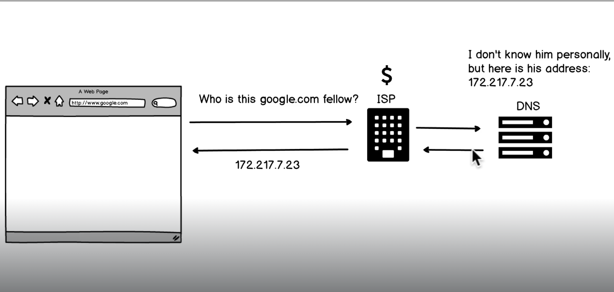
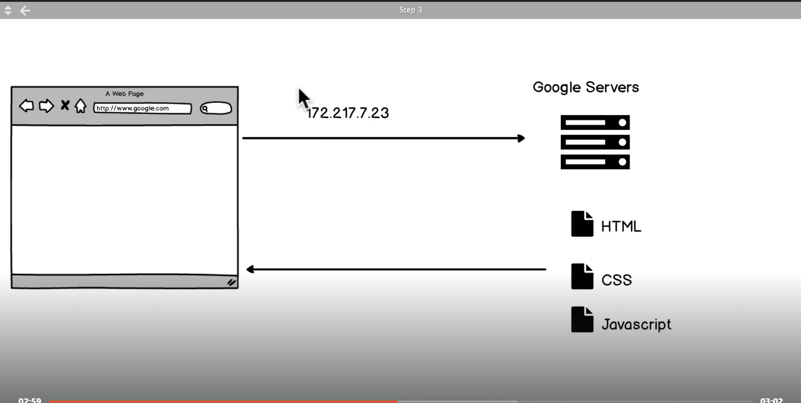
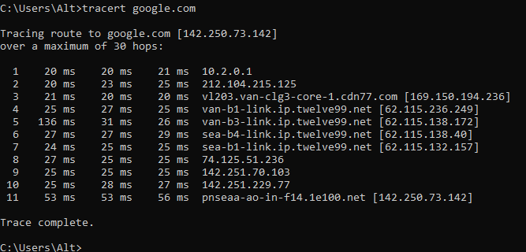
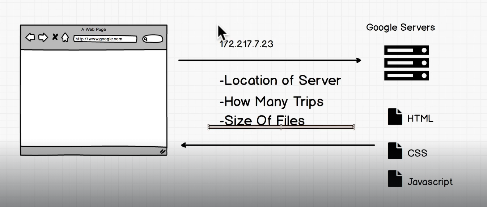

# How The Internet Works

Think of a DNS as a phoneBooks, that has a list of all the URLS  
now after you know the IP address to Google.com  
you can connect to 172.217.7.23 and it will send you all the files needed to load up the page

# Traceroute

using command prompt you can see what happens when you type`google.com`  
and the final 142.250.73.142 is the real google.com ip where i you enter that ip into the browser it will show google.com  
the 11 hops is how many connect points it went from my pc to get to the google servers
# DEVELOPER FUNDAMENTALS: I
How to shorten or optimize website preference, by trying to optimize one of these aspects 
