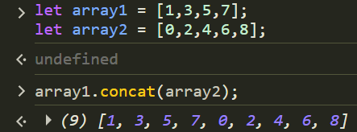

# Chapter 10:JavaScript
## JS functions types:
> 1- function declaration:

```js
function sayHello(){
 console.log("hola") 
}//this is how to declare a function
sayHello(); //this is how to call a function
```
> 2- function expression:
```js
var saybye = function(){
    console.log("bye") //you only need to name the variable and not the function
}
```
## JS Arrays:
an array can hold all the js values like this
```js
let obj = {
	name:`alex`,
	age:12,            //created an object
	married:false
}
let varr = `test`;
let Arr = [1,`Text`,false,undefined, null,``,function apple(){console.log(`Apple`)},obj,varr]
```
### Array properties and methods:
1. >Array.shift()   //this will give you the value of the Array[0], and will remove it after

2. >Array.pop()   //this will give you the value of the Array[length-1], and will remove it after

3. >Array.push(value)  //this will push the value to the last index of the array
4. >Array.concat(newArrayValue) //this will concatenate the orginal array with the newarrayValue like this

>note:methods like push,pop and shift will modify the array, while concat will create a new array without changing the original array
## JS Loop types:
> 1- for loops:
```js
let todo = [`clean room`,`brush teeth`,"exercise","Study JavaScript","eat healthy"];
for(var i = 0;i < todo.length ; i++){
    todo[i] = todo[i]+`!`;
    
}
console.log(todo) ///this will add an ! mark to the end of each
```
> 2- While loops:
```js
let counterOne = 0;
while(counterOne <10){
    console.log(counterOne);
    counterOne++
}
```
> 3- Do while loops: this will iterate first then validate of the condition if right, unlike while loop, which will validate the condition first
```js
var counterOne = 0;
do{
    console.log(counterOne);
    counterOne++
}while(counterOne<=10)
```


