# Chapter 11:DOM Manipulation

## DOM Selectors:

```js
document.getElementsByTagName("h1"); //this will give back the h1 as an array
```
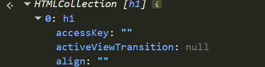
to access the h1 as an HTML element we do:
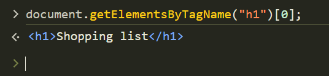
```js
document.getElementsByClassName("second");//this will grab the class an array,
document.getElementsByClassName("second")[0];//this will give you the the element that has the `second` class
document.getElementById(`first`); //this will give you the element that has the id `first`
```
>QuerySelector
```js
document.querySelector(`li`)/// this will find the first li element and select it, just like with scc selectors
or
document.querySelector(#id)///this will select an id
or
document.querySelector(.class)///this will select a class


```
>QuerySelectorAll
```js
document.querySelectorAll(`li`) //this will select all li elements and put them in an array,
document.querySelectorAll(`li,h1`) //you can select muliple element too just like scc
```
>GetAttribute
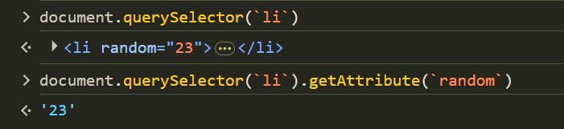


>setAttribute
this one takes two parameters, the attribute name and new value, you can change an existing att or make a new one in an element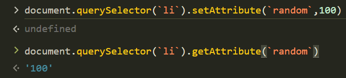
### Changing Styles:
>Style.{property} //ok
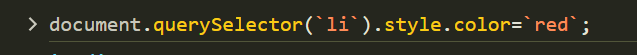

>className (this will add a new class to the element)
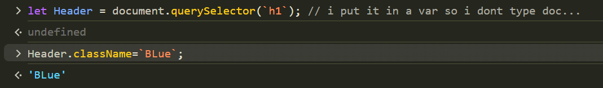
>classList(this will list all the classes in an element,but it can do more it can add aswell, remove and toggle)
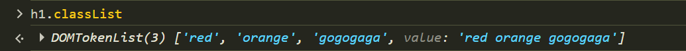

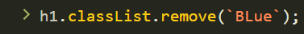
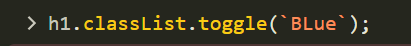  

>`textContent` ( recommended way to add text inside an element like h1)

>innerHTML (not recommended, but it change ot give you the value of the innerHTMl of the element)
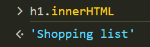
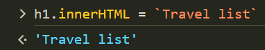

this is all the DOM Selectors
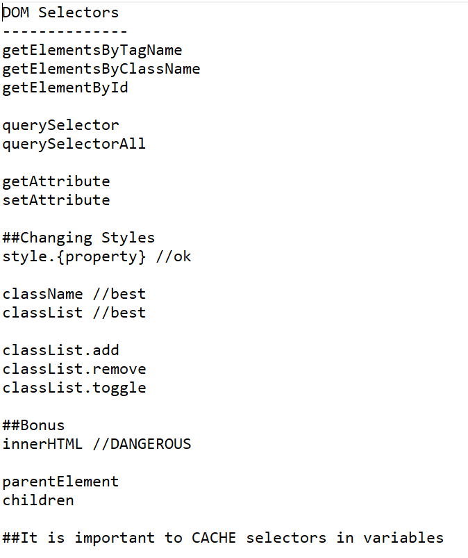

### EventListeners:
>https://developer.mozilla.org/en-US/docs/Web/API/Document_Object_Model/Events this will show all the events in js, but the two much used are keyboard and click
```js
let button = document.getElementById(`Enter`);
button.addEventListener(`click`,function(){
    console.log(`clicked`)
}); //this one listens for clicks to the HTML button

input.addEventListener("keydown", function (event) {
if(event.key===`Enter`){
    console.log(`Enter has been pressed`)//this one listens to keyboard clicks, and in this case enter key was clicked,event param is a built-in param that has alot of properties like .while(to know which key is clicked) or .key
}});

```
>CreateElement
```js
var ul = document.querySelector('ul')
var li = document.createElement("li")//this will create a new HTML Element
let innerContent = document.createTextNode(`text or var`)//this will create the InnerHTML or it can be a var
li.appendChild(innerContent) //this will attach the inner text to the new li element
ul.appendChild(li)//this will attach th e new element li to the parent ul element
```
>you can using an event listener to a parent element like ul, and listen for clicked to il  
and use event param and its properties like `target` or tagName so you dont click on another element inside the parent element

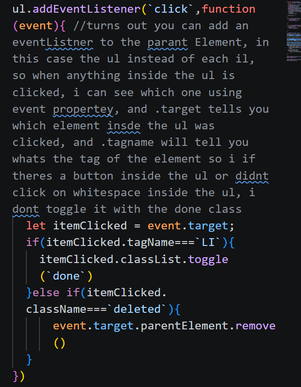