# Advanced JavaScript
## Scope 
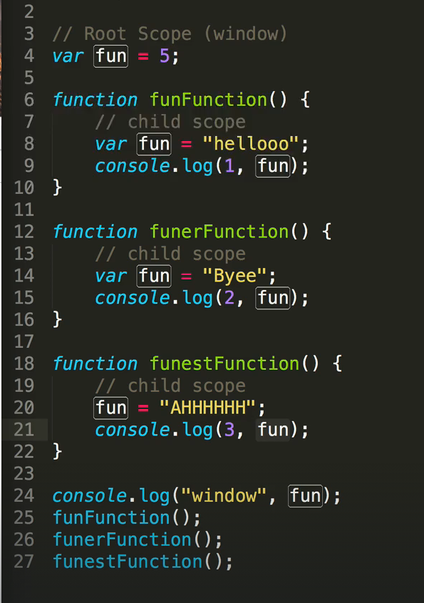
>in this case fun var is overwritten in the funFunction and funerFunction and they lose access to the fun var in the root scope, while funestFunction not only has access to fun var but it can also change it, so if we do console.log(fun) in the end, it will give `AHHHHH`

example 2:
```js
function q3() {
    window.a = "hello";
}
q3(); //this will add an a var to the window scope ana thn function 132 can access it 

function q32() {
    alert(a);
}
q32(); //this will alert hello
```
---
## Ternary operator & switch statements:
### Ternary operator
 > **Condition ? expr1 : expr2;**

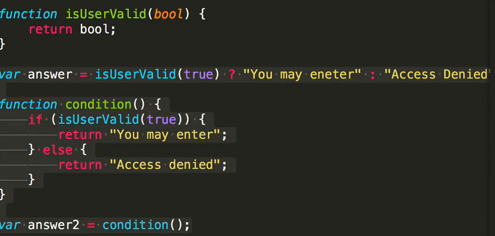
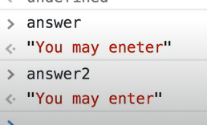
---
### switch statements:
```js
function moveCommand(direction){
    var whatHappens;
    switch (direction){
        case `forward`:
            whatHappens= `you Encount a monster`;
        break; // this will exit outta the switch statement
        case `back`:
            whatHappens= `you arrived home`;
        break;
        case `right`:
            whatHappens= `you found a river`;
        break;
        case `left`:
            whatHappens= `you run into a troll`;
        break;
        default:
            whatHappens = `please enter a valid direction`;
        
    }
return whatHappens
}
```
---
## ES5 and ES6:
1. ### Let and const 
>use **const** when you declare a variable that you dont wanna change the value of, like player name or a function, with const tho, if do const obj, you cant reassign it, so **obj = 5** wil give an error, but you cant change individual properties like player and wizardLevel
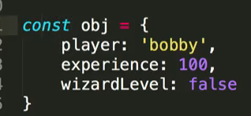

>use **Let** just like **var** but the difference is that Let stays inside the scope, unlike var, just like in the blow example, if we did: var wizardLevel = false; then the console.log will be true on both logs
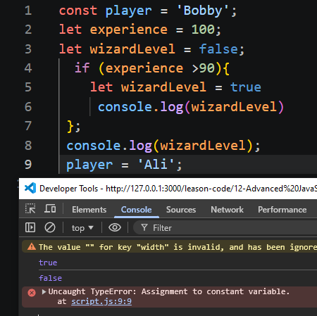

2. ### destructuring:
```js
const obj = {
    player :'Bobby',
    experience : 100,
    wizardLevel :false,
}
///old way of grabbing individual properties and making them a var
const player = obj.player;
const experience = obj.experience;
let wizardLevel = obj.wizardLevel;
///new way in ES6
const {player,experience} = obj;
let {wizardLevel} = obj;
//and now you can use player,experience and wizardLevel anywhere in the code like an individual variable

```
3. ### Object properties:
```js
const name = 'John snow';
const obj = {
    [name]:'hello', //you can use an existing var as a property
    [1+2] :'hihi' //or use dynamic value as a property;
}
```
```js
const a = 'Simon';
const b = true;
const c = {};
const obj = {
   // old way of adding these vars to an obj
    // a:a,
    // b:b,
    // c:c,
    a,  // new way
    b,
    c,
}

```
4. ### Template stings:
```js
let name = "john";
let feeling = 'well';
//old way sting concatenation
const greetings = "hello" + name +"hope you're doing "+feeling + "!"
//new way Template string
const greetings = `hello ${name} hope your doing ${feeling} ! `
```
5. ### Default Arguments:
```js

function greet(name = "john",age=30,pet='cat'){
return `hello ${name}, you seem to be ${age-10} years ago, with a lovely ${pet} as a pet ! `
}
greet();
```
now calling greet() without an argument will give you default values
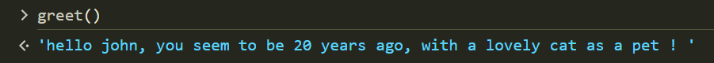


6. ### Symbol js type:
```js
let sym1 = Symbol()
let sym2 = Symbol('foo');
let sym3 = Symbol('foo');
//BUT sym2 !== sym3
//because Symbol sign creates a unique value 

```

7. ### Arrow Functions:
```js
//Old way of writing functions:
function add(a,b){
    return a + b;
}

// new way of writing functions(arrow functions) is the shorthand way of writing functions, adn this way is called function expression 
const add = (a,b) => a + b; // you dont need to write ***return*** either
```
---
## Advanced Functions:
1. ### Closure in js:
```js
 const first = () => {
    const greet = "hi";
    const second = ()=>{
         alert(greet)
    }
    return second;
 }

 const newFunc =first();
 newFunc();
 ```
 ***Closure: a function ran,the function executed ie(first()), It's never going to execute again but its going to remember that there are references to those variables so the child scope always has access to the parent scope, but not the other way around***
 
 2. ### Currying:
 ***the process of coverting a function that takes multiple arguments into a function that takes the arguments one at a time***
 ```js
const multiply = (a,b)=> a * b; ///this is the original function
const curriedMultiply = (a)=>(b)=> a*b; //this is a curried function

   
const multiply = (a,b)=> a * b; ///this is a curried function using function expression 
function curriedMultiply2 (a){
    return function (b){
        return a*b;
    }
};

 ```
 ***why you'd wanan use it?***
```js
const multiply = (a,b)=> a * b; ///this is the original function
const curriedMultiply = (a)=>(b)=> a*b;
const multipyBy10 = curriedMultiply(10); // now a is defaulted to 10, and multipyBy10(b) takes b as the the argument 
```

 3. ### compose:
 ***is the act of combining two or more functions together to create a brand-new function.***
 ```js
 //compose in js

const compose = (f,g) =>(a) => f(g(a));
const sum = (num)=> num +1;
compose(sum,sum)(5)
```
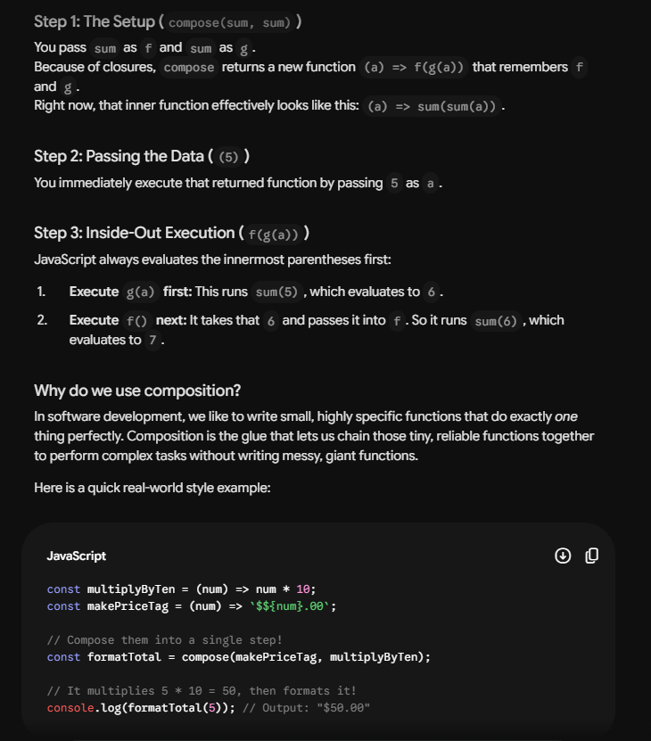
---
4. ### Functional purity and Avoiding Side Effects;
>if you wanna avoid side effects in functions ie the function shouldnt affect variables outside of the function scope, you always want to return something and not leave the function output undefined, so the function is always deterministic like this:
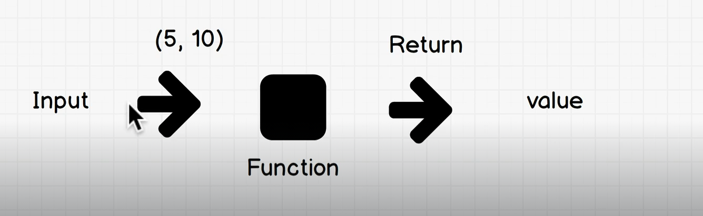
---

## Advanced Arrays:
>https://sdras.github.io/array-explorer/ for resources 
1. ### forEach Method()
this one is a quick way to iterate/loop through an array, but it always returns ***Undefined***, it takes up to 3 arguments(the currment element,index,original array)
```js
const  array = ["Apple","Banana",'Carrot',"Peach"];
const doubledArray = [];

array.forEach((CurrentElement,index,Whol) => {

    console.log(`This is Current element:${CurrentElement} and the index is :${index} & and the original array is:  ${Whol}`) 
    //This is Current element:Apple and the index is :0 & and the original array is:  Apple,Banana,Carrot,Peach
    //his is Current element:Apple and the index is :0 & and the original array is:  Apple,Banana,Carrot,Peach
} );
```
---
2. ### **map()**
its like foreach() but it always returns a new array, and leaves the original array untouched, and with map() you always have to **return** in the function
```js
const  array = [1,2,10,16];
const mapArray = array.map((num) =>{
     return  num*2;
});
// or do const mapArray = array.map(num => return  num*2); since if its only one line in the arrow function it auto returns it
;
console.log(`map():`,mapArray)
```
---
2. ### **filter()**
filter() loops through an array, runs a check on every item using your callback function, and creates a brand-new array containing only the items that passed the test.

Think of it like a bouncer at a club door checking IDs.
**The Golden Rule of filter(): Return a Boolean**
```js
const  array = [1,2,10,16];

const filterArray = array.filter(num => {
    return num>5;
});
console.log(filterArray)//[10, 16]


```
***OR***
```js
const  array = [1,2,10,16];

const filterArray = array.filter((_, i) => i % 2 === 0); //in this case we didnt have use for num(aka the current item) and only needed the index, so we put _ instead of num,
console.log(filterArray) // [1, 10]
```
---
2. ### **reduce()**
reduce() is designed to take an entire array and distill (or "reduce") it down into a single value. That single value could be a number, a string, a boolean, or even a brand-new object or array!. ***and you much return a value inside the callback function***
* **syntax**
```js
array.reduce(function(accumulator, item, index) {
    // code here
}, startingValue);
```
* **example**
```js
const numbers = [5, 10, 15];

const totalSum = numbers.reduce(function(accumulator, num) {
    // Whatever you RETURN here becomes the NEXT accumulator value for the next loop!
    return accumulator + num; 
}, 0); // <- 0 is our starting value!

console.log(totalSum); // Output: 30
```
**OR**
```js

const  array = [1,2,10,16];

const reducedArray = array.reduce((accumulator,num) =>{
    return accumulator + num
},0); // 0 here is the starting value, so if the starting value =1 then reducedArray will be 30
console.log(reducedArray)// 29

```
---
## Advanced Objects:
1. ### Reference type in js:
all data types in js other than Objects are **primitive type**, but objects are **reference type**
```js
var obj1 = {value:10};
var obj2 = obj1;
var obj3  = {value:10};
obj1===obj2 //True
obj1===obj3 //False
obj2.value = 15;
console.log(obj1.value) //15
```
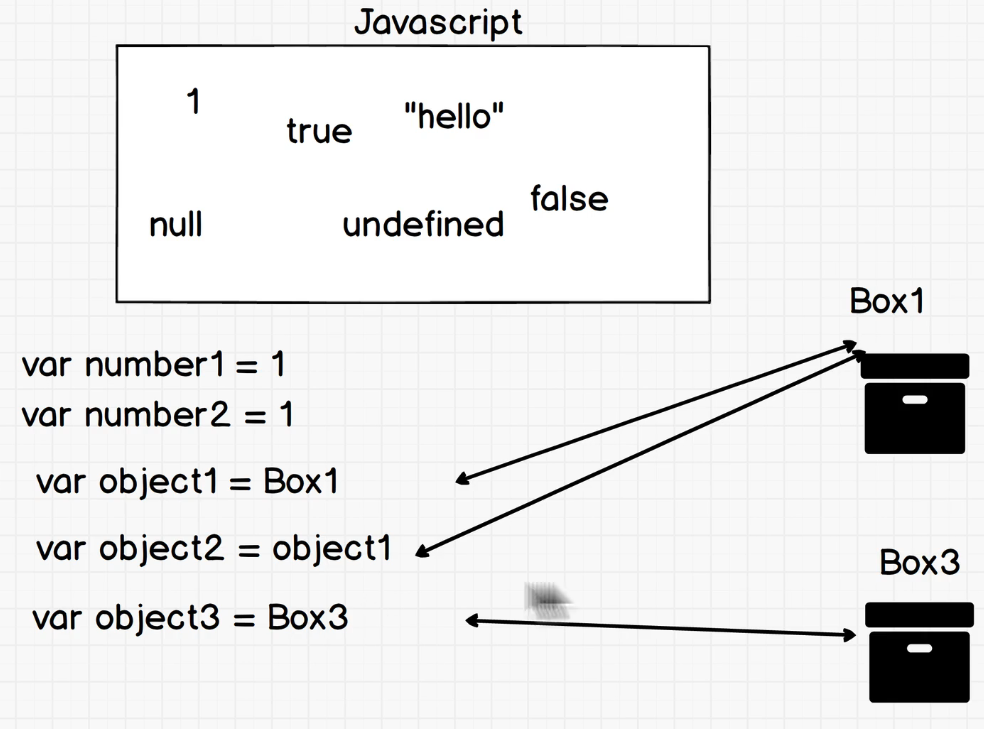
>arrays are objects too so they're reference type
---
2. ### context in js:
In JavaScript, **this** always references the **object** that currently owns the executing code.
```js
console.log(this)//Window {window: Window, self: Window, document: document, name: '', location: Location, …}
```

```js
const obj4 = {
vlaue:14,
    test:`hello`,
    a:function(){
        console.log(this)//{vlaue: 14, test: 'hello', a: ƒ}
    }
}
```
---
2. ### instantiation in js:
```js
class Player {
  constructor(name,type){
    console.log(`player`, this);
    this.name = name;
    this.type = type;
  }
  introduce(){
    console.log(`Hi I am ${this.name}, I'm a ${this.type}`)
  }
}
class Wizard extends Player {
  constructor(name,type){
    super(name, type)
    console.log(`wizard`, this);
  }
  play(){
    console.log(`Weeeeee I'm a ${this.type}`)
  }
}

const wizard1 = new Wizard("Shelly", "Healer");

```


Instantiation is the process of creating a real, concrete object (an instance) from a code blueprint (a Class or Constructor function).

The Class: The architectural blueprint (e.g., class Car {}).

The Instance: The actual physical car built from that blueprint.

🔑 The Magic Keyword: new
You instantiate an object by using the new keyword.

```js
// 1. The Blueprint
class Player {
    constructor(name) {
        this.name = name;
    }
}

// 2. The Instantiation
const player1 = new Player("Shelly"); 
```
**⚙️ What happens under the hood?**
When you type new Player("Shelly"), JavaScript automatically performs 4 steps:

Creates a brand-new empty object {}.

Binds the this keyword to that new empty object.

Runs the constructor() function to fill the object with data (setting this.name = "Shelly").

Returns that freshly built object so you can save it to a variable (player1).

**🚀 Why use it?**
Instead of manually copy-pasting code to make 100 different user objects, you write one blueprint and efficiently instantiate it 100 times.

---
## Pass by Value vs pass by reference:
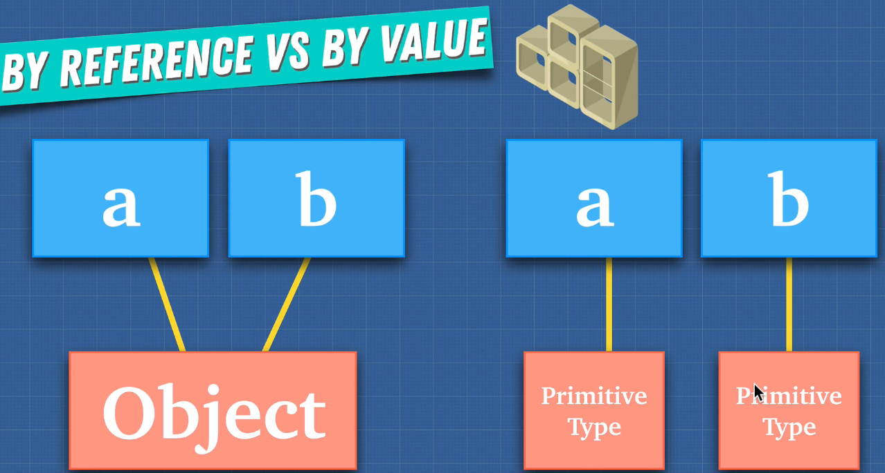
how to copy and objects value into a new space in memory:
```js
let obj = {a:'a',b:`b`,c:`c`};
let clone = Object.assign({},obj);// old way of copying an obj
let clone2 = {...obj};// new way of copying

obj.c = 5;
console.log(clone2 )// c value is still "c"
```
**shallow copying**
```js
let obj = {a:'a',
  b:`b`,
  c:{deep:`copy me plz`},
   };
let clone = Object.assign({},obj);// old way of copying an obj
let clone2 = {...obj};// new way of copying

obj.c.deep = `hehehe i got changed`;
console.log(clone )// c.deep value is still `hehehe i got changed`, this is because we shallow copied the object so only the primitive values like srings got changed
```
**deep copying** using JSON
```js
let obj = {a:'a',
  b:`b`,
  c:{deep:`copy me plz`},
   };
let clone = Object.assign({},obj);// old way of copying an obj
let clone2 = {...obj};// new way of copying
let superClone = JSON.parse(JSON.stringify(obj))

obj.c.deep = `hehehe i got changed`;
console.log(superClone )// c.deep value is didnt change now,beauce we turned obj from an object to stings and truned it back to an obj again
```
## ES8 (ES2017):
### how to iterate through an Object:
1. **using object.key()**
```js
let obj = {
    username0 : "Santa",
    username1 : "Rudolf",
    username2 : "Mr.Grinch"
}

Object.keys(obj).forEach((k, i) => {
    console.log(k,obj[k]) //username0 Santa
                          // username1 Rudolf
                          // username2 Mr.Grinch
})
```
---
2. **using object.values()**
```js
Object.values(obj).forEach(value => {
    console.log(value) //Santa
                          //Rudolf
                          //Mr.Grinch
})
```
---
2. **using object.etries()** this truns each obj property and value into arrays, and you can use array properties like filter, map and reduce 
```js
Object.entries(obj).forEach(value => {
    console.log(value) //['username0', 'Santa']
                          //['username1', 'Rudolf']
                          //['username2', 'Mr.Grinch']
})
```
---
## Advanced loops:
### for of:
**its a simple and readable way for writing a for loops and it combines for loop +forEach loop, and it works with iterable values like arrays and strings**
```js
const basket = ['apples',`oranges`,`grapes`];
for (item of basket){
    console.log(item);  //apples
                        //oranges
                        //grapes
}

```
### for in:
**For in will Enumerate in objects and go though the keys/ properties of the obj**
```js
const detailedBasket = {
    apples: 5,
    oranges :10,
    grapes : 1000,
};
for(item in detailedBasket){
    console.log(item) //apples
                        //oranges
                        //grapes
                                    // this will give u the keys/ properties 
}


    console.log(`Number of ${item}:${detailedBasket[item]}`)  // this will give you the values of the keys
               // Number of apples:5
              //Number of oranges:10
             //Number of grapes:1000


```
---
## ES2020:
### optional Chaining operator:
**Syntax: ?.**

**What it does: Short-circuits and immediately returns undefined if the property before it is null or undefined.**

**Why use it: It keeps your code clean and prevents your application from crashing when dealing with unpredictable or missing nested data.**
```js
const user1 = {
    name: "Alex",
    profile: {
        address: { city: "Vancouver" }
    }
};

const user2 = {
    name: "Sam" // No profile object at all!
};
```
If you try to grab Sam's city using traditional dot notation, your app crashes:
```js
console.log(user2.profile.address.city);
// ❌ CRASH! TypeError: Cannot read properties of undefined (reading 'address')
```
Because user2.profile is undefined, trying to read .address off of it breaks JavaScript completely.

The Solution: ?.
By replacing standard dots with ?., you tell JavaScript: "Hey, if the thing to the left of this dot exists, keep going. If it is null or undefined, stop right there and just give me back undefined."
```js
console.log(user1?.profile?.address?.city); // Output: "Vancouver"
console.log(user2?.profile?.address?.city); // Output: undefined  (No crash! 🎉)

```
---
### Nullish Coalescing operator (??)
**Syntax: ??**

**What it does: Returns the right-hand value only if the left-hand value is exactly null or undefined.**

**The Difference: Unlike ||, the ?? operator treats 0, false, and "" as completely valid data and will not override them.**

---
## ES2021:
### replaceAll():
```js
let str = "Today is a good day frfr";
str = str.replaceAll("good","ight");
console.log(str) // Today is a ight day frfr
```
---
## ES2022:
### at()
```js
let arr = [100,200,400,5000,10];
 console.log(arr[arr.length-2]) //5000 Old way
 console.log(arr.at(-2)) //5000 New way, a negative num will count backwards so -1, is the last item in the arr, -2 it the one before the last, and 0 is the first item
```
----
## ES2023:
### findLast()
**it reads from right to left and find the last item, in the example below, if i wasnt using findLast(), this is how it wouldve looked to find the last monster obj thats level 15 or higher**
```js
const ztmMonsters = [
    {id:1,monster:'Mr,Mouse',level:1},
    {id:2,monster:'Mac',level:30},
    {id:3,monster:'Denodude',level:17},
    {id:4,monster:'Pye',level:5},
]

const findlvl15orHigher = ztmMonsters.filter(item=>item.level >=15);


let lastMonster = findlvl15orHigher[findlvl15orHigher.length-1];
console.log(lastMonster) //{id: 3, monster: 'Denodude', level: 17}
```
**this is how it looks using findLast()**
```js
const lastMonster2 = ztmMonsters.findLast(item=>item.level>=15);
console.log(lastMonster2) // same results, but shorter)
```
### findLastIndex():
**last as findlast but it doesn't return the last item itself but it returns the index of the last items index,so from the last example**
```js
const lastMonster2Index = ztmMonsters.findLastIndex(item=>item.level>=15);
console.log(lastMonster2) //2 , because the {id: 3, monster: 'Denodude', level: 17} obj is at inedex 2, it returns -1 if no items met the condition
```
### toReversed()
```js
const ztmMonstersList = ['Mr,Mouse', 'Mac', 'Denodude', 'Pye'];
console.log(ztmMonstersList.reverse(),ztmMonstersList); // This will change the original array,
ztmMonstersList.toReversed() //this will reverse the array and give a new array without changing the original array
```
### toSorted():
**this is like the method sort() that sorts the array aphabetically, but unlike sort(), toSorted() doesnt modifly and mutate the original array**
---
### toSpliced():
**takes two parameters, tte first is the index, and the 2nd is how many items will getting removed**
```js
let arr = [`Denodude`,`Mac`,`Mr.Mouse`,`Pye`];
let modArr =arr.toSpliced(2,1);
console.log(modArr) //[`Denodude`,`Mac`,`Pye`];

```
---
### with():
**The with() method is an incredibly clean, modern array tool. It lets you change the value of a single item at a specific index without altering or destroying your original array.**
```js
const shoppingList = ["Apples", "Milk", "Bread"];

// 🎯 The modern, safe way:
const updatedList = shoppingList.with(1, "Almond Milk");

console.log(updatedList);  
// Output: ["Apples", "Almond Milk", "Bread"] (The new copy)

console.log(shoppingList); 
// Output: ["Apples", "Milk", "Bread"] (The original is perfectly safe! 🎉)
```
---
## ES2024
### groupBy():
***The Object.groupBy() method is an absolute game-changer. It takes an array of items and automatically sorts them into buckets based on a condition you give it, returning a neatly organized object.**
```js
const pokemons = [
  { name: "bulbasaur", type: "grass"},
  { name: "blastoise", type: "water"},
  { name: "charmander",  type: "fire"},
  { name: "ivysaur", type: "grass"},
  { name: "charmeleon",  type: "fire"},
  { name: "charizard",  type: "fire"},
  { name: "squirtle", type: "water"},
  { name: "venusaur", type: "grass"},
  { name: "wartortle", type: "water"},
  { name: "pikachu", type: "electric"}
];
const sortedPokies =Object.groupBy(pokemons,(i)=>i.type);
console.log(sortedPokies);
const sortedPokies2 =Object.groupBy(pokemons,(i)=>i.type.includes(`water`));
console.log(sortedPokies2)
```
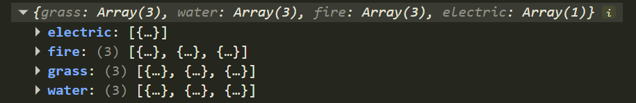
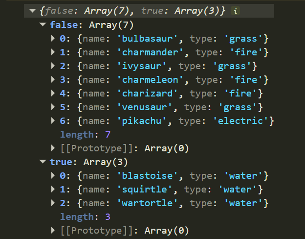


