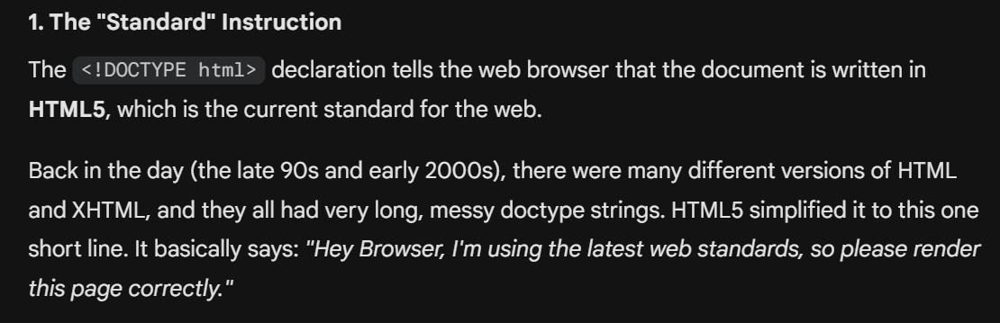
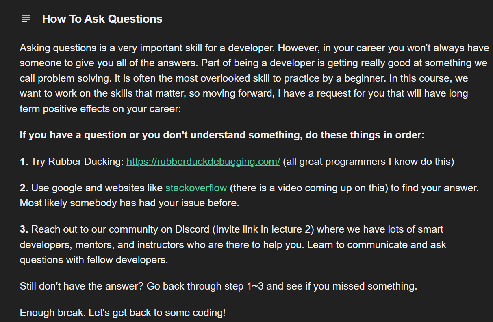
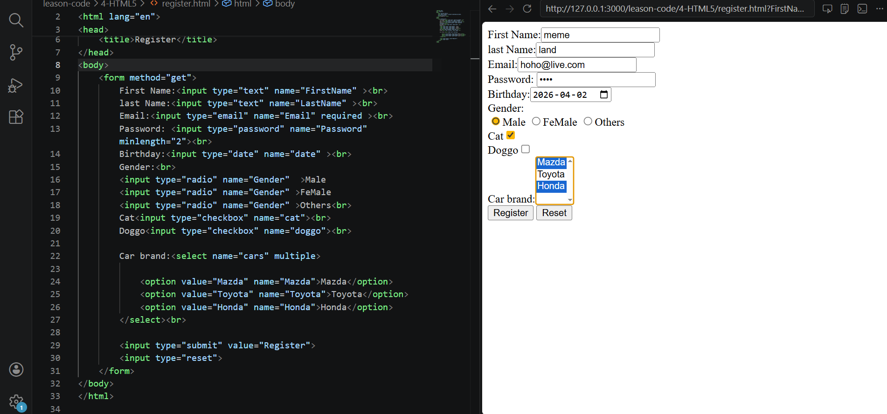

# Build Your First Website
The basic structure of HTML is this:
```html
<!DOCTYPE html>
<html lang="en">
<head>
    <meta charset="UTF-8">
    <meta name="viewport" content="width=device-width, initial-scale=1.0">
    <title>Document</title>
</head>
<body>
    
</body>
</html>
```
# DEVELOPER FUNDAMENTALS: III
IF theres something i dont understand it, try to Google it or ask AI how that works or what it means  

the meaning of `<!DOCTYPE html> `  

# How To Ask Questions

# HTML Tags
```html
<ol></ol> (this is an ordered list)
<ul></ul> (this is an unordered list)
<li></li> (this is the actual list, it should be inside ordered or unordered list tags)
<p></p>(paragraph tags)
<b></b>(anything inside it is made BOLD, but old and not sematic HTML)
<i></i>(anything inside it is made emphasis, but old and not sematic HTML)
<strong></strong>(anything inside it is made BOLD,HTML5)
<em></em>(anything inside it is made emphasis,HTML5)
<br> (its a line break and its a self closing tag)
<hr> (its a horizontal line break and its a self closing tag)
(image)
<a href="link location(could be a site or another files like an HTML)" target="_blank" (this opens the link in a new page) >(this as an anchor tag)
    <form>
        <input type="text"> (this is a form tag and inside it is an input tag to enter text, and its a self closing tag  | *required* will make sure you cant submit without filling out that input | )
        <input type="submit" value="Register"> (this will make a button that submits and *value="Register"* will change what the text box says)
        Email:<input type="email" required > (this makes sure that the input is an email with an @ and a . )
        
    </form>
```



>how to comment Ctrl + /

``how to copy a whole ass website Ctrl+U   ``


