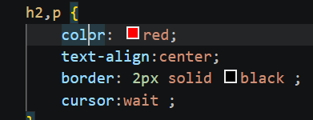

# How to use CSS

``` css 
selector {
     Property: value;
}
```
# How to link an HTML to a css

``` html 
  <link rel="stylesheet" href="style.css">
}
```
and add this line under the title inside the head section 
---
# the 3 ways of adding CSS to an HTML
1. external by using `<link rel="stylesheet" href="style.css">`
2. internal by using `<style></style>` in the`<head>` tag
3. inline like this`<h1 style="color: blue;">`
---
> https://css-tricks.com/almanac/  
this site is for all the CSS properties and questions

---
# CSS Selectors
1. >How to apply one proparty to the two selctors 
2. `float: left;` is used for images so text can wrap around them/use`clear: both;` after float so it stops the next property from getting floated 
3. `padding : 10px 30px 10px 30px;` that way the 1st value is top-padding, 2nd is right, 3rd is bottom and 4th is left. so its clock-wise. or use `padding : 10px 30px;` as a shortcut where 10px is top and bottom and 30px is right and left, same concept with margin.
4. 
5. 
6. 