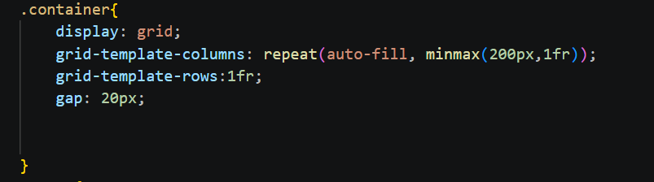
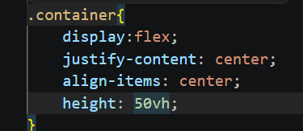
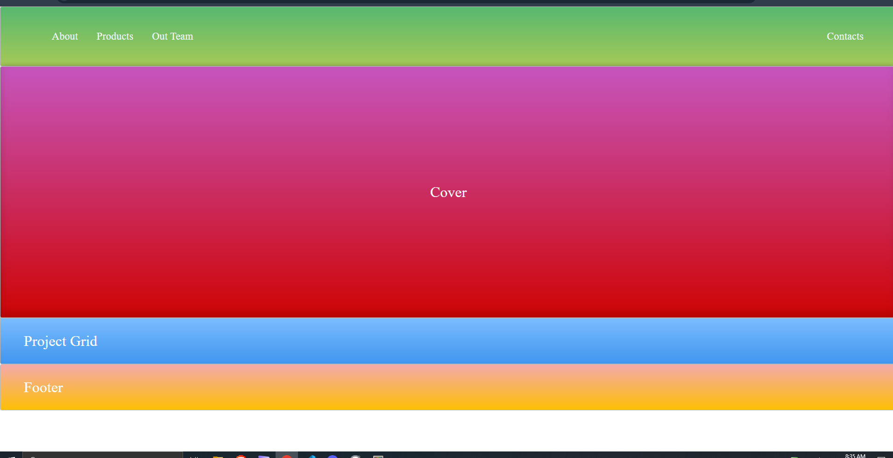
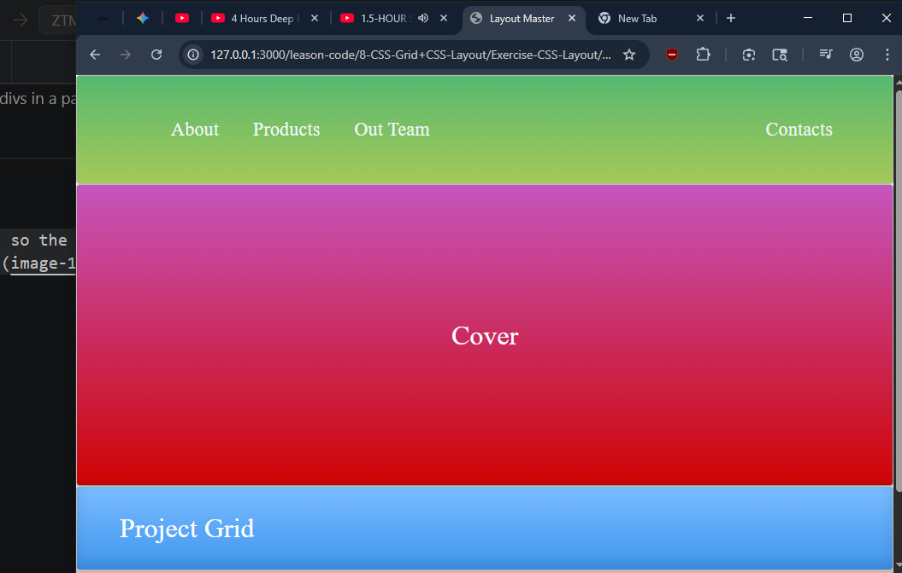

# Chapter 8:CSS Grid + CSS Layout
## CSS Grid:
How to use it:  
1- put all the items/divs in a parent div and give a class like `container` but it can be anything  
2- give the class container property of `display: grid`  
3-and customize it by defining the rows and columns using ` grid-template-columns` & ` grid-template-rows` by giving each item a `fr` value
---
>Good Grid layout

---
Grid Cheat-sheet
>https://grid.malven.co/ 
---
try using vh instead of px for heights so the page is responsive if using containers like here 

---

